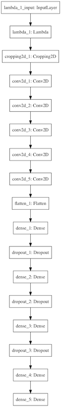
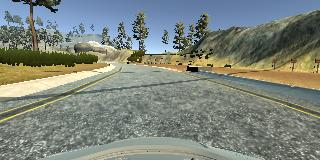
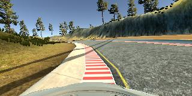
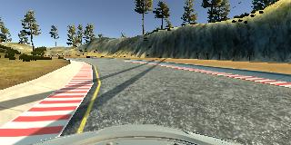
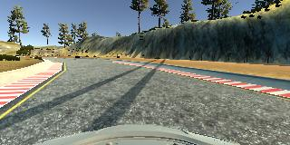
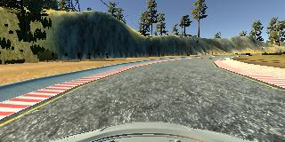
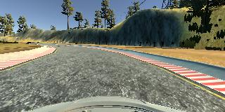

# Behavioral Cloning Project

## Files Submitted

* `model.py`: containing the script to create and train the model
* `drive.py`: for driving the car in autonomous mode
* `model.h5`: containing a trained convolution neural network
* `writeup.md`: summary of the result
* `drive-images.mp4`: Recorded video for driving the car in autonomous mode

### Model Architecture and Training Strategy

#### 1. An appropriate model architecture has been employed

I implemented `get_model` function in model.py.

#### 2. Attempts to reduce overfitting in the model

As I showed above, I assembled dropout layers to reduce a risk to overfitting(model.py line 103)

The model was trained and validated on different data sets to ensure that the model was not overfitting (model.py line 134).
The model was tested by running it through the simulator and ensuring that the vehicle could stay on the track.

#### 3. Model parameter tuning

I used adam optimizer to train the model, so the learning rate was not tuned manually (model.py line 134).

The model used an adam optimizer, so the learning rate was not tuned manually (model.py line 25).

#### 4. Appropriate training data

Training data was chosen to keep the vehicle driving on the road. I used a combination of center lane driving, recovering from the left and right sides of the road.

As well as, I flipped original iamges in order to augment training data (model.py `augment_data` function). Because of flipping images, I multiply steering magnitudes by -1.

### Model Architecture and Training Strategy

#### 1. Solution Design Approach

The overall strategy for deriving a model architecture was inspired by NVIDIA's neural network architecture ([End\-to\-End Deep Learning for Self\-Driving Cars](https://devblogs.nvidia.com/parallelforall/deep-learning-self-driving-cars/))

My first step was to use a single convolutional neural network model, since I wanted to confirm its performance to drive appropriately.
After that, I modify the model to be close NVIDIA's neural network architecture step by step.

In the beginning, a model which I was composing was going wrong.
When the car was driving along a side line which was shadowed, it seemed that my car lost control.
In another case, when the car was driving on the road whose right line doesn't exist on a corner, the car lost control as well.

Then, I decided to add drop out layer to combat over-fitting.
At the end of the process, the vehicle is able to drive autonomously around the track without leaving the road.

####2. Final Model Architecture

My model basically follows NVIDIA's network architecture.
However, I added some dropout layers to combat overfitting, as I mentioned.

1. Normalize color by pixcel
2. Cropping images to drop unnecessary parts
3. Convolution layer with 5x5 filter sizes and 24 depth and with ReLu activation function
4. Convolution layer with 5x5 filter sizes and 36 depth and with ReLu activation function
5. Convolution layer with 5x5 filter sizes and 48 depth and with ReLu activation function
6. Convolution layer with 3x3 filter sizes and 64 depth and with ReLu activation function
7. Convolution layer with 3x3 filter sizes and 64 depth and with ReLu activation function
8. Flatten layers
9. Fully-connected layer to 100 nodes.
10. Fully-connected layer to 50 nodes with dropout layer
11. Fully-connected layer to 20 nodes with dropout layer
12. Fully-connected layer to 10 nodes with dropout layer
13. Fully-connected layer to 1 nodes with dropout layer

#### 3. Creation of the Training Set & Training Process

To capture good driving behavior, I first recorded seven laps on track one using center lane driving. Here is an example image of center lane driving:

I also recorded two laps in the opposite direction to help the network regularize.

I then recorded the vehicle recovering from the left side and right sides of the road back to center so that the vehicle would learn to do this by itself when it goes too much to the right or left. These images show what a recovery looks like starting from...

To augment the data set, I also flipped images and angles to help the network regularize (prevent overfitting). For example, here is an image along with its flipped counterpart:

After the collection process, I had about 60,000 data points. I preprocessed this data by removing the top 48 rows and resizing it to one eighth of its original size.

I finally randomly shuffled the data set and put 20% of the data into a validation set.

I used this training data for training the model. The validation set helped determine if the model was over or under fitting. The ideal number of epochs was 10 as evidenced by the result. I used an adam optimizer so that manually training the learning rate wasn't necessary.
